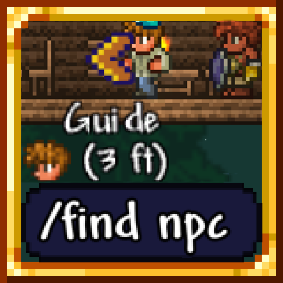

# NPCFinder

<!-- PROJECT LOGO -->
 

  

  <h3 align="center">NPCFinder</h3>

  An amazing terraria mod that tracks all NPCs and uses pathfinding algorithms to track them!

  

    <a href="<strong> [View Demo](##Demo) »</strong></a>
     
     
    <a href="https://steamcommunity.com/sharedfiles/filedetails/?id=3418974288">Workshop Page</a>
    &middot;
    <a href="https://github.com/emyhrberg/NPCFinder/issues?q=sort%3Aupdated-desc+is%3Aissue+is%3Aopen">Bug Report</a>
  

## Demo

